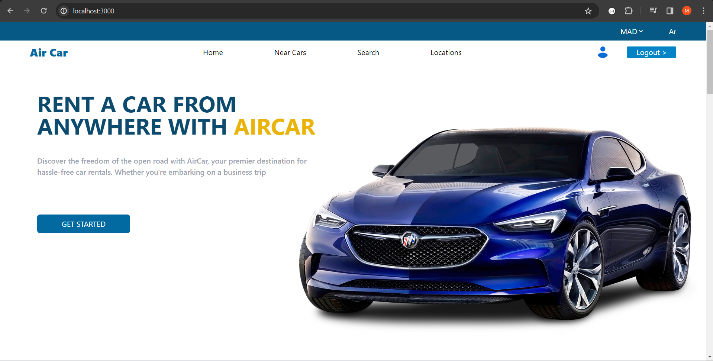
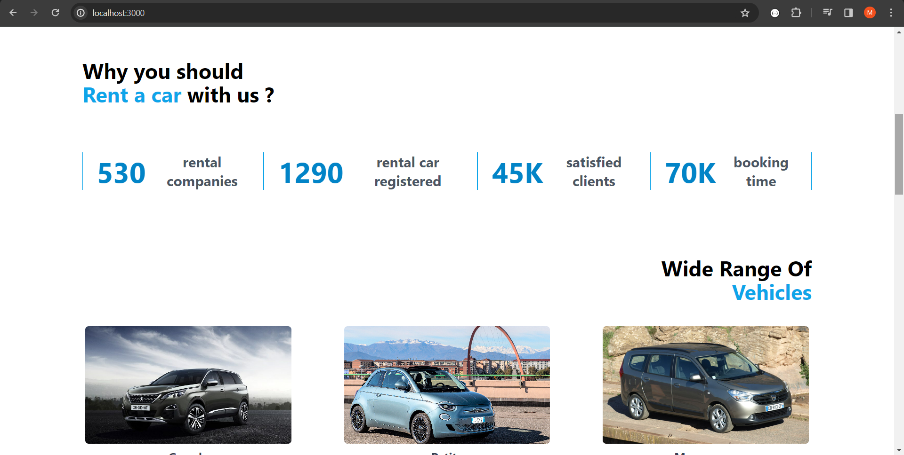
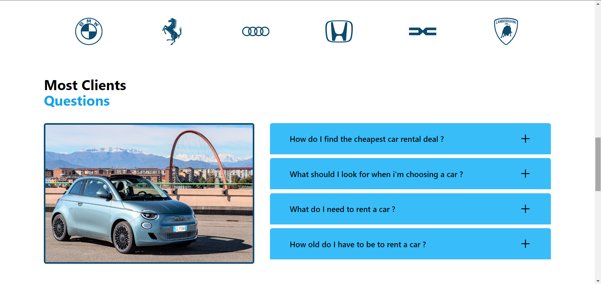
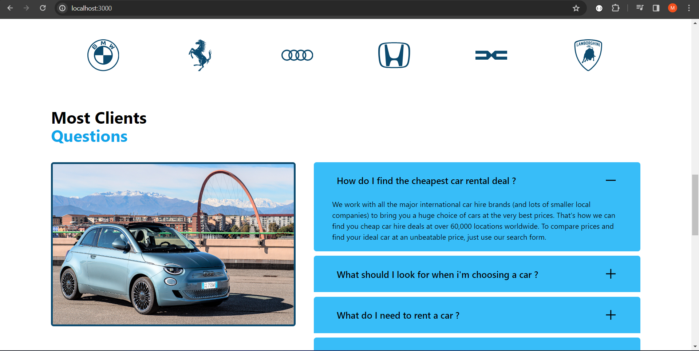
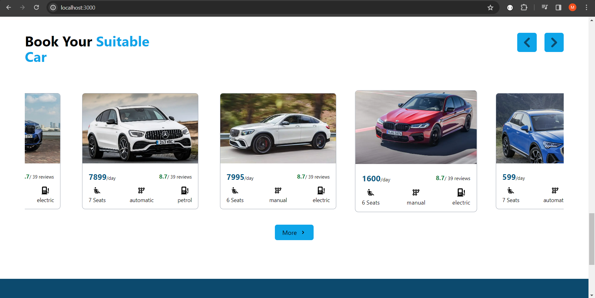
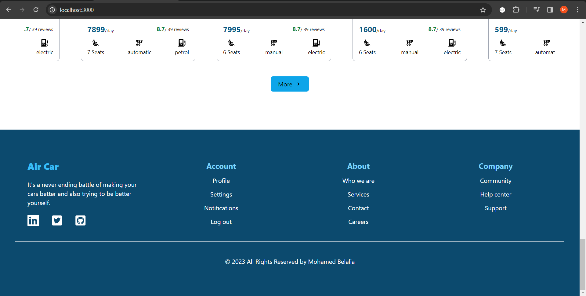

# Aircar
#### 
AirCar is a car appointment website. In the frontend, I used React.js and Tailwind CSS. In the backend, I used PHP and Dompdf to generate the invoice PDF. Additionally, I integrated two APIs to facilitate cars searching . The website is responsive for all screens.

#
## Some of pages of aircar website
#
## 
 Home Page 

### 
 Footer 

<!--  
git add .
git commit -m "P2"
git push 
-->