# Aircar
#### 
AirCar is a car appointment website. In the frontend, I used React.js and Tailwind CSS. In the backend, I used PHP and Dompdf to generate the invoice PDF. Additionally, I integrated two APIs to facilitate cars searching . The website is responsive for all screens.

#
## Some of pages of aircar website
#
## 
 Home Page 

### 
 Footer 

## 
 Login & Signup as Client 

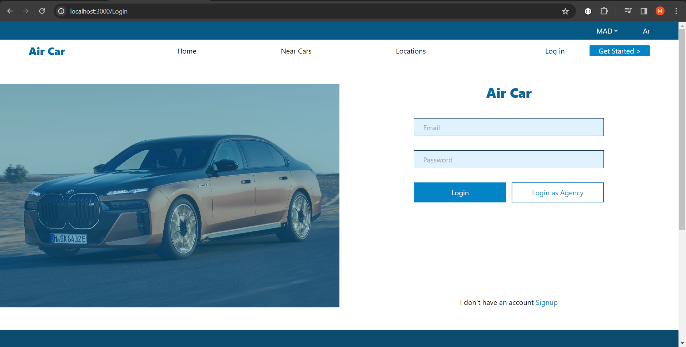
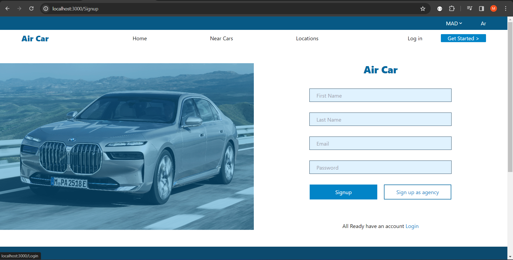

## 
 Login & Signup as Agency 

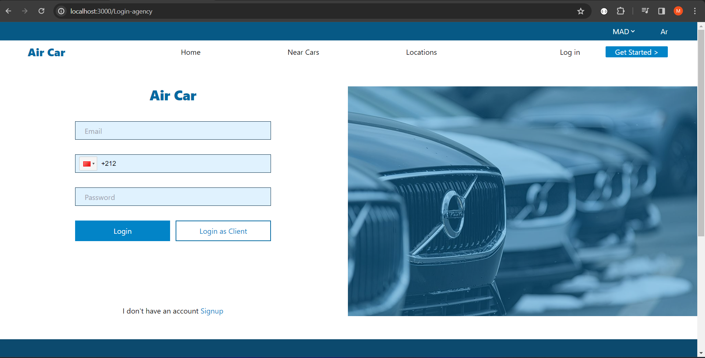
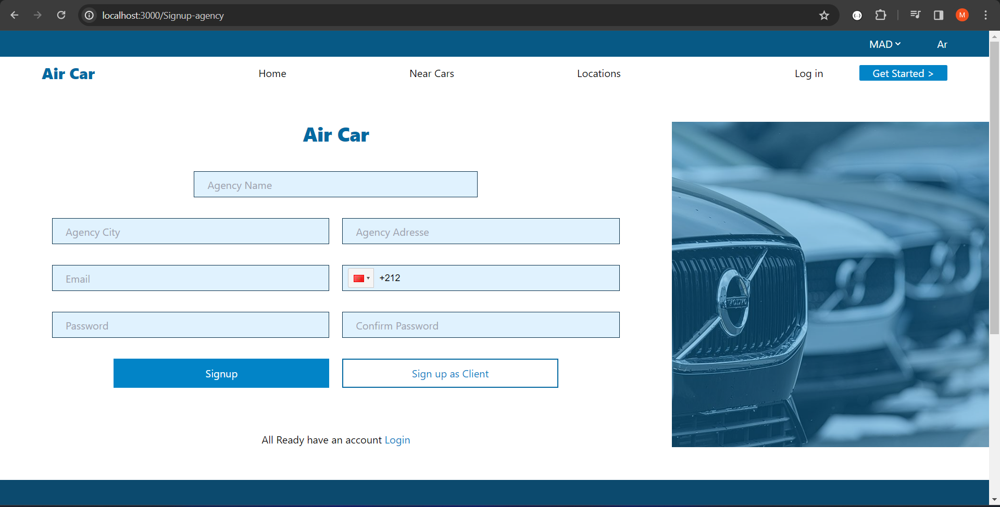

## 
 Search Page 

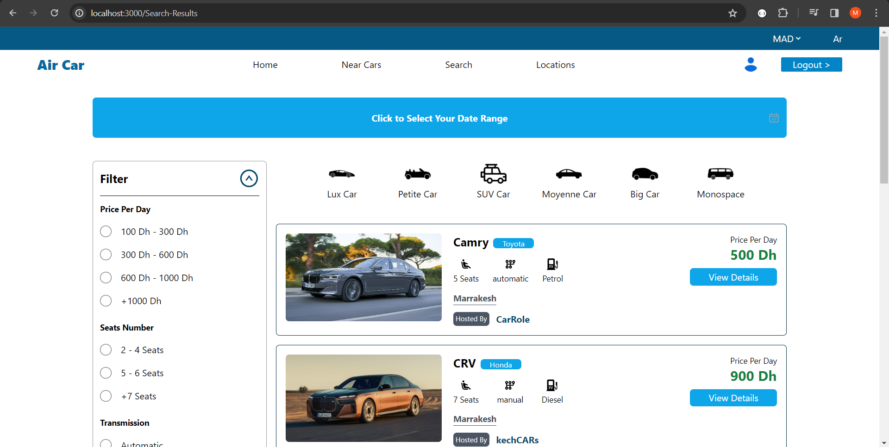
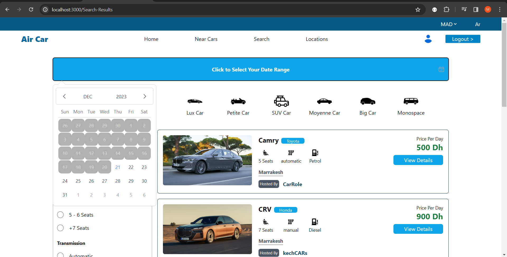
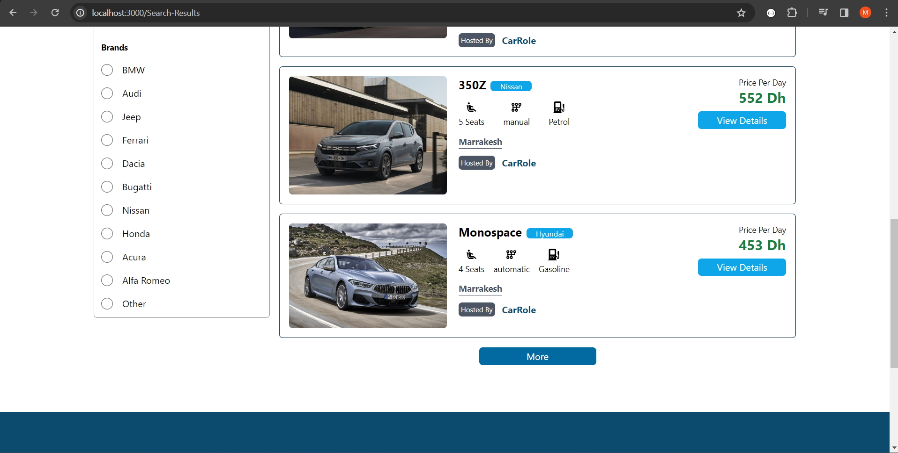

## 
 Single Car Page 

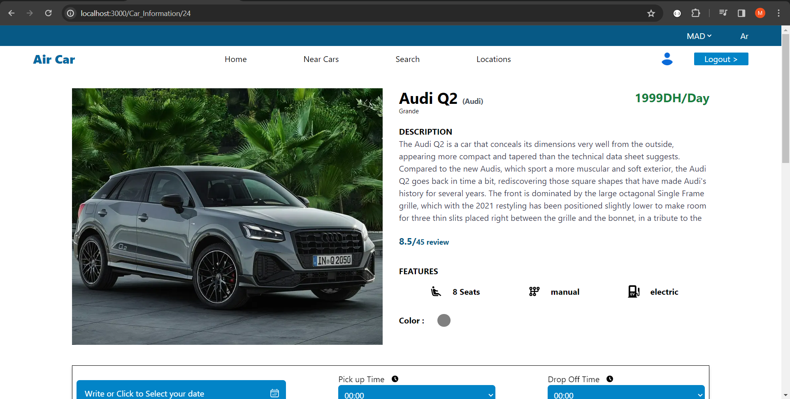
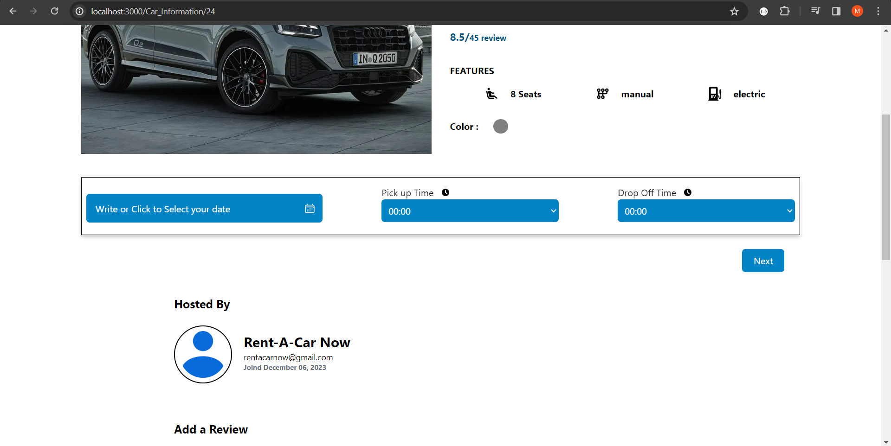

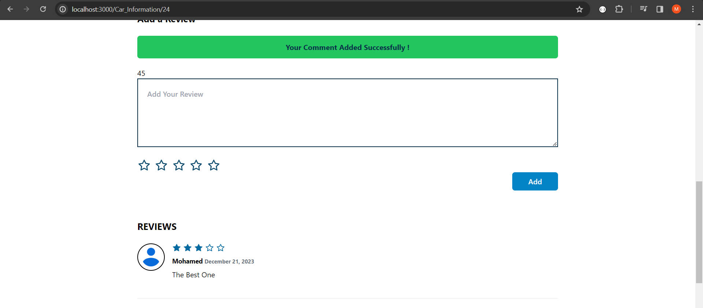
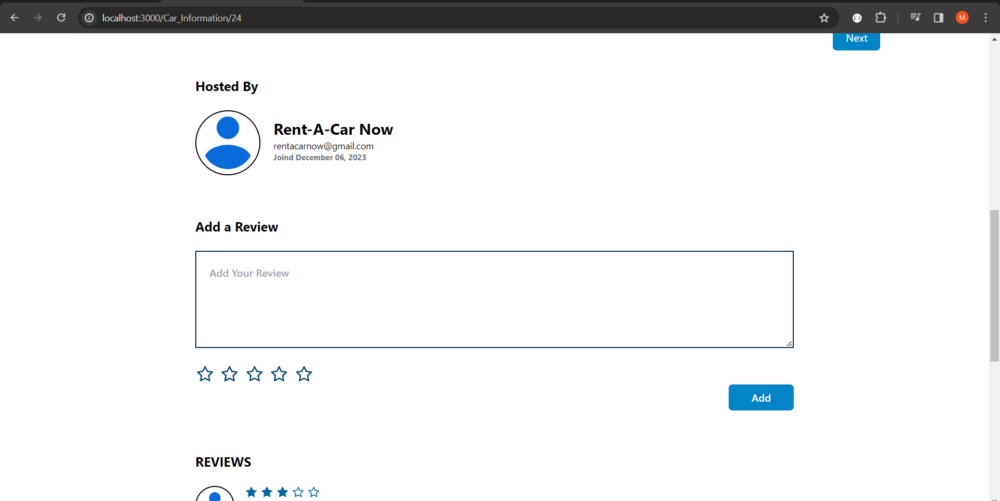

## 
 Agency Profile 

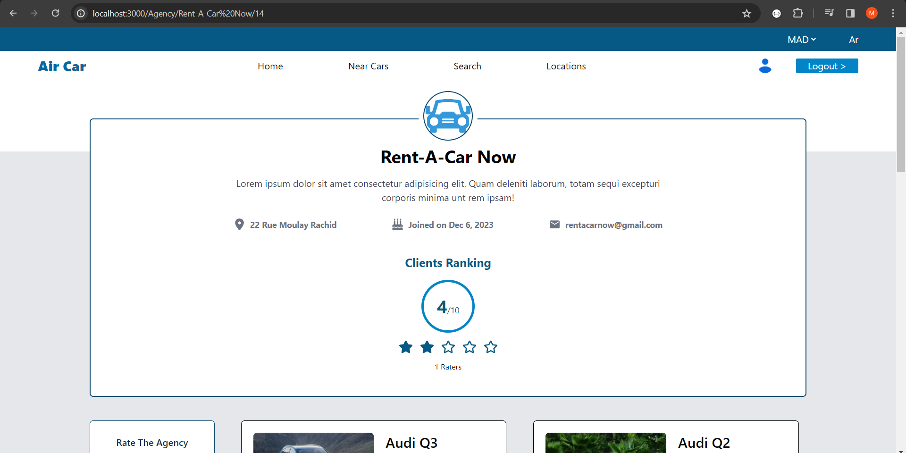
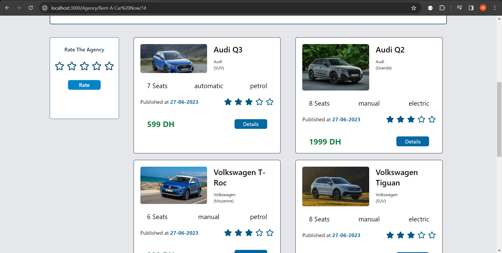

<!--  
git add .
git commit -m "P2"
git push 
-->