# Aircar
#### 
AirCar is a car appointment website. In the frontend, I used React.js and Tailwind CSS. In the backend, I used PHP and Dompdf to generate the invoice PDF. Additionally, I integrated two APIs to facilitate cars searching . The website is responsive for all screens.

#
## Some of pages of aircar website
#
## 
 Home Page 

### 
 Footer 

## 
 Login & Signup as Client 

## 
 Login & Signup as Agency 

## 
 Search Page 

## 
 Single Car Page 

## 
 Confirm Car Appointment Popup 

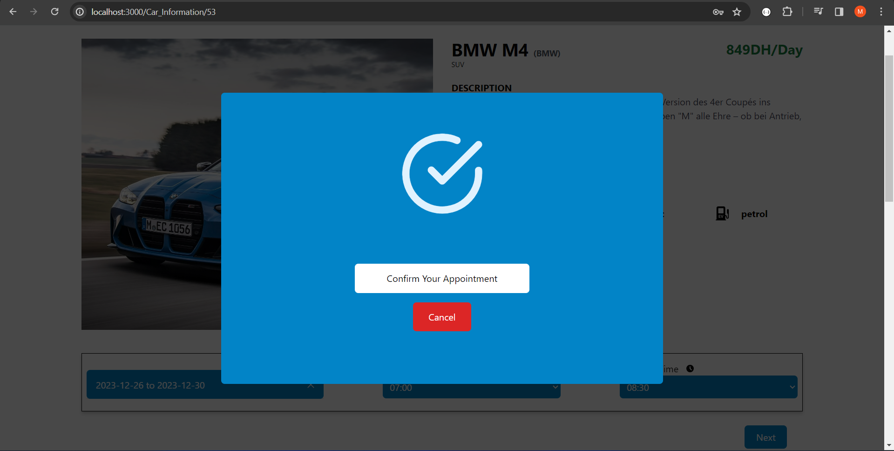

## 
 Agency Profile 

## 
 Agency Dashboard 

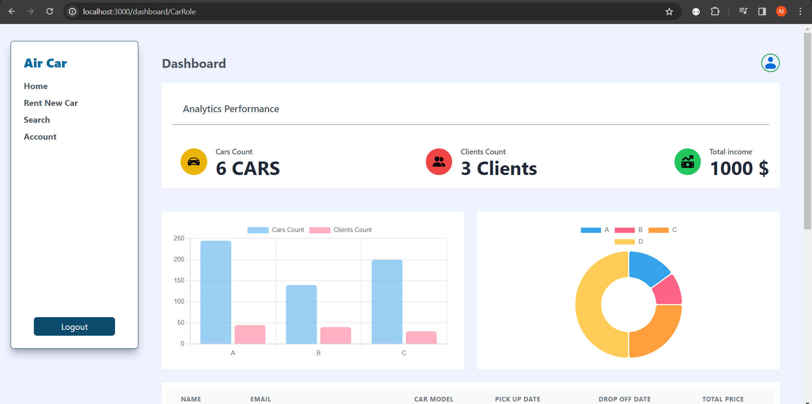
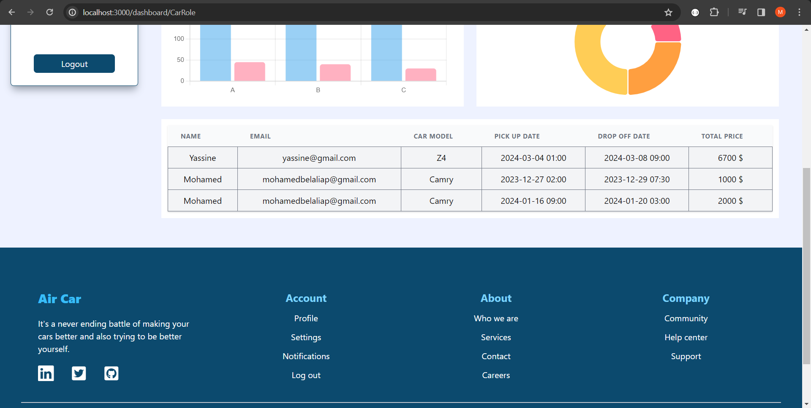

## 
 Publishing a Car 

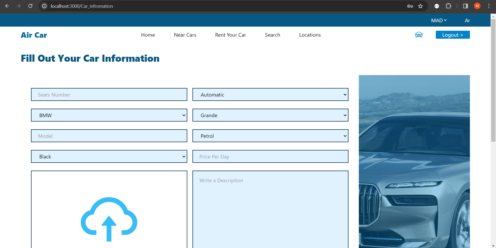
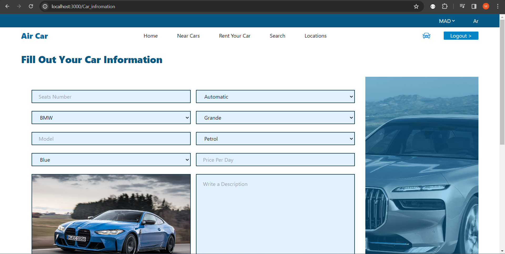
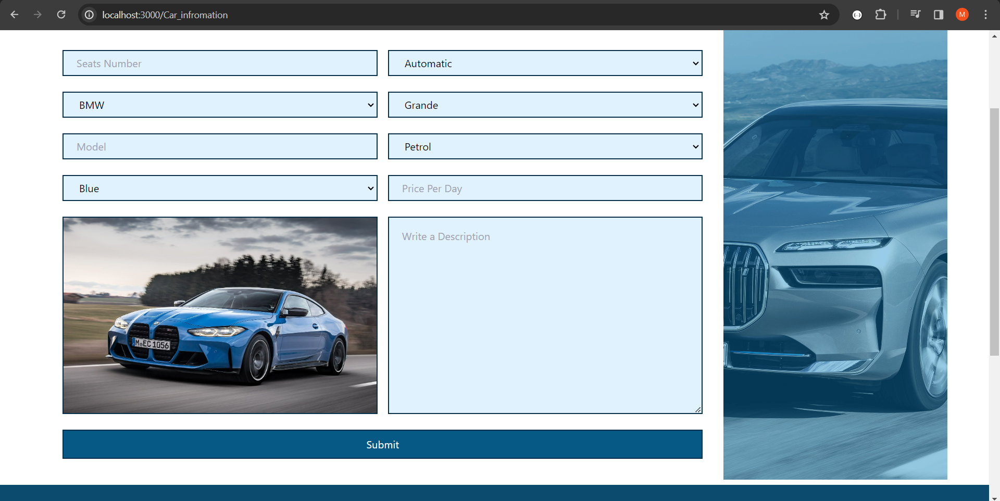

## 
 Some Of Responsive Pages 

  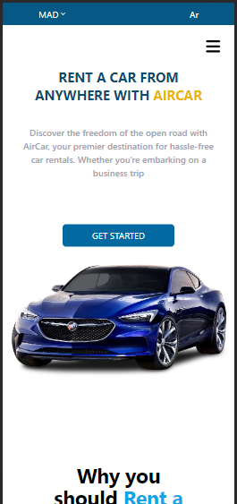
  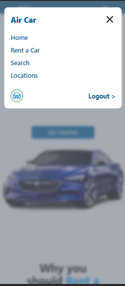

  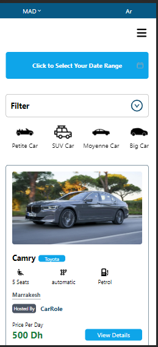
  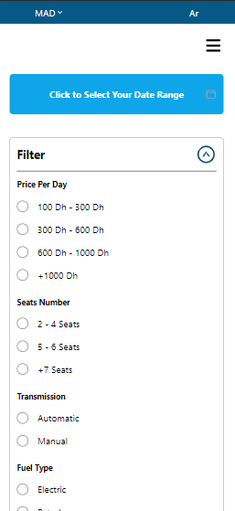

  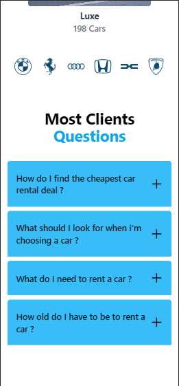
  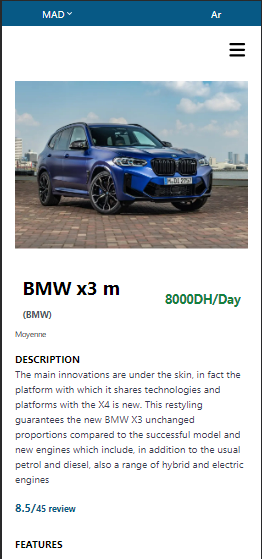

#

  <a href="https://github.com/mohamedBelalia/aircar-backend">🤖See The Backend Part🤖</a>

    I worked on this project in order to practice both react.js and php 🫡

